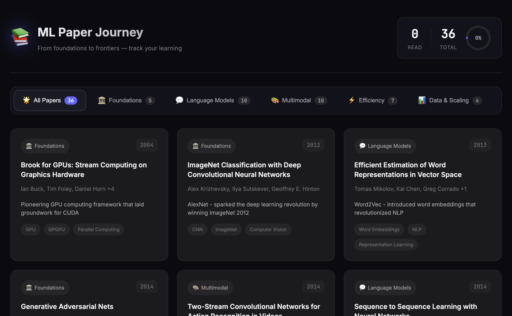

# ML Paper Journey 📚

A personal learning tracker for essential Machine Learning and AI papers. Track your reading progress through foundational papers in deep learning, from AlexNet to GPT-4.



## Features

- 🎨 **Bento Grid Layout** - Modern Apple-style card design
- 🌙 **Read/Unread States** - Unread papers appear grayscale, read papers glow
- 🏷️ **Category Filtering** - Filter by Foundations, Language Models, Multimodal, Efficiency, or Data
- 📝 **Reading Notes** - Track your thoughts with markdown files
- 📊 **Progress Tracking** - Visual progress ring shows completion percentage
- 📱 **Responsive** - Works on desktop, tablet, and mobile

## Quick Start

### 1. Deploy to GitHub Pages

1. Fork this repository
2. Go to Settings → Pages
3. Set source to "Deploy from a branch"
4. Select `main` branch and `/docs` folder
5. Your site will be live at `https://yourusername.github.io/repo-name/`

### 2. Track Your Reading

Papers start as **unread** (grayscale cards). To mark a paper as **read**:

1. Create a markdown file in `docs/notes/` with the paper's ID
2. Add your reading notes
3. The card will automatically light up!

**Example**: To mark "Attention Is All You Need" as read:

```bash
# Create the notes file
touch docs/notes/transformer-2017.md
```

Then add your notes:

```markdown
# Attention Is All You Need - Notes

## Key Takeaways
- Self-attention replaces recurrence
- Multi-head attention allows parallel processing
- Positional encoding preserves sequence order

## Questions
- How does the attention mechanism scale?
```

### 3. Paper IDs Reference

| Paper | ID |
|-------|-----|
| Attention Is All You Need | `transformer-2017` |
| BERT | `bert-2018` |
| GPT-3 | `gpt3-2020` |
| ResNet | `resnet-2015` |
| AlexNet | `alexnet-2012` |
| ... | See `papers.json` for full list |

## Project Structure

```
ML_AI/
├── .gitignore              # Git ignore rules
└── docs/                   # GitHub Pages root
    ├── index.html          # Main page
    ├── styles.css          # Styling
    ├── app.js              # JavaScript logic
    ├── papers.json         # Paper metadata
    ├── preview.png         # Preview image
    ├── README.md           # This file
    └── notes/              # Your reading notes
        ├── transformer-2017.md
        ├── resnet-2015.md
        └── gpt3-2020.md
```

> **Note**: PDF 論文資料夾 (基礎模型/、語言模型/、多模態/、模型效率與優化/、數據/) 僅存於本地，不上傳至 Git。

## Customization

### Adding New Papers

Edit `docs/papers.json`:

```json
{
  "id": "my-paper-2024",
  "title": "My Paper Title",
  "authors": ["Author 1", "Author 2"],
  "year": 2024,
  "category": "language-models",
  "filename": "paper.pdf",
  "arxiv": "2401.12345",
  "significance": "Brief description of importance",
  "tags": ["Tag1", "Tag2"]
}
```

### Categories

- `foundations` - 🏛️ Core architectures (CNN, Transformer, GAN)
- `language-models` - 💬 NLP & LLMs (GPT, BERT, Word2Vec)
- `multimodal` - 🎨 Vision-Language (CLIP, Diffusion, ViT)
- `efficiency` - ⚡ Optimization (LoRA, MoE, Scaling Laws)
- `data` - 📊 Datasets & Infrastructure (LAION, Scaling)

## Tech Stack

- Pure HTML/CSS/JS (no build step required)
- GitHub Pages compatible
- Markdown support via marked.js (optional)

## License

MIT - Use freely for your personal learning journey!

---

Happy reading! 🚀
